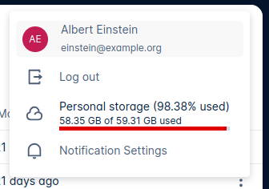
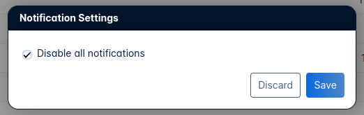

# Google Summer of Code 2023 - CERN

  

This is the official description of a project that took place during the summer of 2023. I was part of [Google Summer of Code](https://summerofcode.withgoogle.com/) (referred to as GSoC) with [CERN](https://www.home.cern/) as my organization. Officially, during GSoC 2023, [HSF-CERN](https://hepsoftwarefoundation.org/) was the umbrella organization that I applied to. The title of the project was: **Extend and improve the CERNBox Notifications platform**. The following document will describe the initial task, how it changed, what was developed, and what still needs to be done in the future.

  

The following links are the official merged pull request on GitHub, which acts as the main and final deliverable I submitted as part of GSoC 2023. Currently, this links to my mentor's fork of the larger project. This will be updated once a merge to the main repository is done (after code reviews are finished and the internal changelogs are updated).

  

- [https://github.com/javfg/reva/pull/1](https://github.com/javfg/reva/pull/1)

- [https://github.com/javfg/cernbox-web/pull/1](https://github.com/javfg/cernbox-web/pull/1)

  

This and other projects can be found on my personal GitHub:

[https://github.com/daniel-sparemblek](https://github.com/daniel-sparemblek)

  

Up-to-date as of **August 28th, 2023**.

  

### Deliverables

Some tasks were changed during the course of the project.

  

The initial set of deliverables were:

- [x] Extensions of the current back-end architecture as well as extensions in the front-end UI.

- [x] Documentation on the implementation, reusability, extensibility, and testability of the system, alongside a guide on how to use the UI.

- [ ] The extension of the simple notifications into a notifications center in the UI, including settings for filtering the MIME type of the file. (PARTIALLY DONE)

- [ ] A richer API system for notifications that include metrics analysis - how many files of a certain type have been shared with the user in the last week/month.

  

These last two were changed to the following:

- [x] An extension of the notifications system that includes a framework for adding different filtering settings for notifications.

- [x] Filtering of all notifications for a user - a user can disable all notifications.

  

More on the changes and why they happened can be found in a later section. For now, let's describe the task that was done.

  

# Task

  
  

The task given was a medium 175-hour-long project to extend the CERNBox platform. [CERNBox](https://cernbox.web.cern.ch/cernbox/) is a sync-and-share collaborative cloud storage solution developed at CERN, used by more than 37K users and storing over 18PB of data.

  

At the start of the project, CERNBox had a simple notifications system in place - a notification is triggered (a user receives a notification) when a file is shared with them. My task was to improve the aforementioned notifications system by implementing the necessary framework needed for users to disable notifications, e.g. disable notifications for files shared in a certain folder, disable notifications for all files shared by a certain user.

  

Firstly, a framework was needed - a simple, user-friendly interface, connected to the backend that fetches user preferences from the database. With this framework, further additions to the notifications platform could easily be made in the future.

  

The primary task was to develop the framework so that new settings could easily be created and managed. For testing purposes, a trivial example was used - **disable all notifications**. This proved to be a useful tool to test how the pipeline from user interaction on the frontend towards the backend/database functioned.

  

### Frontend - Vue JS (TypeScript)

The current user menu was extended with a button that opens a modal with settings. The default or user-configured settings are loaded into the modal during the initial (or any recurrent) page load. The following is a screenshot of the newly added button, alongside the opened modal.

  
  

  
  

The implementation of the frontend was fairly trivial, a new Modal was created that offered the user the option to disable (or enable) **all** notifications using a simple checkbox. Functions for storing and fetching the notifications settings were also created. This was done using *VueJS 3.0's Composition API*. The `store` function makes an *HTTP PATCH* request to the backend while the `fetch` function makes a *GET* request to fetch the data in an XML format. The parsing of the XML was done using `DOMParser`, but the final parsing will be done using owncloud's SDK.

  

### Backend - Go (MySQL)

  

In the backend, the task was not as trivial. The first goal was to identify the correct pipeline that will be used for storing and fetching notification preferences from the database. An already existing table for preferences was used (the same one is used for localization, i.e. choosing user language preferences). Next up - creating the functions that recieve the aforementioned HTTP requests. These then *forward* the request by querying the database for the needed values. Multiple services, handlers and manager files needed to be changed in order to keep the well-managed architectural pattern set in place by CERN's codebase.

  

# What wasn't done?

I mentioned that the final delivarables difer from the initial proposal. The initial proposal talks a lot about [MIME types](https://developer.mozilla.org/en-US/docs/Web/HTTP/Basics_of_HTTP/MIME_types), which my mentor and I decided to scrap from the changed project due to a) time restrictions and b) the more important project of developing the framework needed to add different types of settings to the notifications platform (MIME type filtering among others). The richer API system for metric analysis was also scraped due to time constraints. Both of which will be mentioned in a later section.

  

# Final remarks

  

Generally, the most difficult part of GSoC was making sure that I have access to enough features of the CERNBox system while still maintaining security by not allowing me direct access to the internal development and test versions. This was done through a [Docker Compose](https://docs.docker.com/compose/) tool, which is a tool for defining and running multi-container Docker applications. Using this environment had it's restrictions as well - developing a local notifications system for local users proved to be a challenge.

  

With everything said, I still managed to learn a lot. Although I've worked with JavaScript frameworks, I haven't worked with VueJS specifically, which I now have a better understanding of. Similarly Docker was something that I only briefly worked with before, so having to learn more about containerization and Docker Compose proved to be extremely useful. For this project I had to use Git extensively, so my understanding of Git has improved massively, especially in regards to forking, pull requests, and submodules. Lastly, Go was a language I was not too familiar with, but after this project, I am much more comfortable with both the syntax and certain unique language concepts!

  

# Future work

  

With the framework in place, a plethora of different notification settings can now be added. Starting with the aforementioned MIME types, but also filtering for certain users, folders, or similar. Alongside this, as one of the initial deliverables, a metrics system could be created to see e.g. how many files of a certain type have been shared with a user in the last X days.

  

As the set of extended deliverables mention, the CERNBox platform can also be extended with a tagging system where the user is able to group notifications and sort them by tags such as *IMPORTANT* or *UPDATE*. A snoozing option could also be added which allows the user to snooze a notification so that it appears in a certain amount of time.

  

As mentioned before, a merge to the main repository has still not been done due to this being a more complex process. I will update this file once a merge has been approved and done, but for now, these are the links to the main repositories:

  

- [https://github.com/cernbox/web](https://github.com/cernbox/web)

- [https://github.com/cernbox/reva](https://github.com/cernbox/reva)

  

Lastly, the documentation will be added as soon as it is approved. It will be hosted on the CERNBox documentation website: [https://cernbox.docs.cern.ch/](https://cernbox.docs.cern.ch/)

  

# Acknowledgment

  

I’d like to thank my mentor **Javier Ferrer** for following me throughout the whole project. He has been extremely helpful since the first contact. This project wouldn’t have gone smoothly without his help, encouragement, and enthusiasm.

  

[https://github.com/javfg](https://github.com/javfg)
